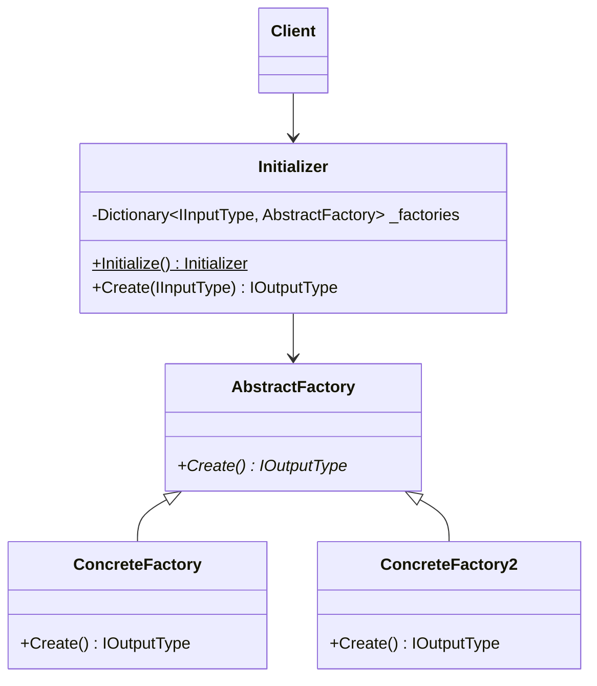

# Generic Factory
### Generic version of my favorite factory pattern implementation

```mermaid
classDiagram
    Client --> Initializer
    Initializer --> AbstractFactory
    AbstractFactory <|-- ConcreteFactory
    AbstractFactory <|-- ConcreteFactory2
    
    Initializer : -Dictionary~IInputType, AbstractFactory~ _factories
    Initializer : +Initialize() Initializer$
    Initializer : +Create(IInputType) IOutputType
    AbstractFactory : +Create()* IOutputType
    ConcreteFactory : +Create() IOutputType
    ConcreteFactory2 : +Create() IOutputType
```
