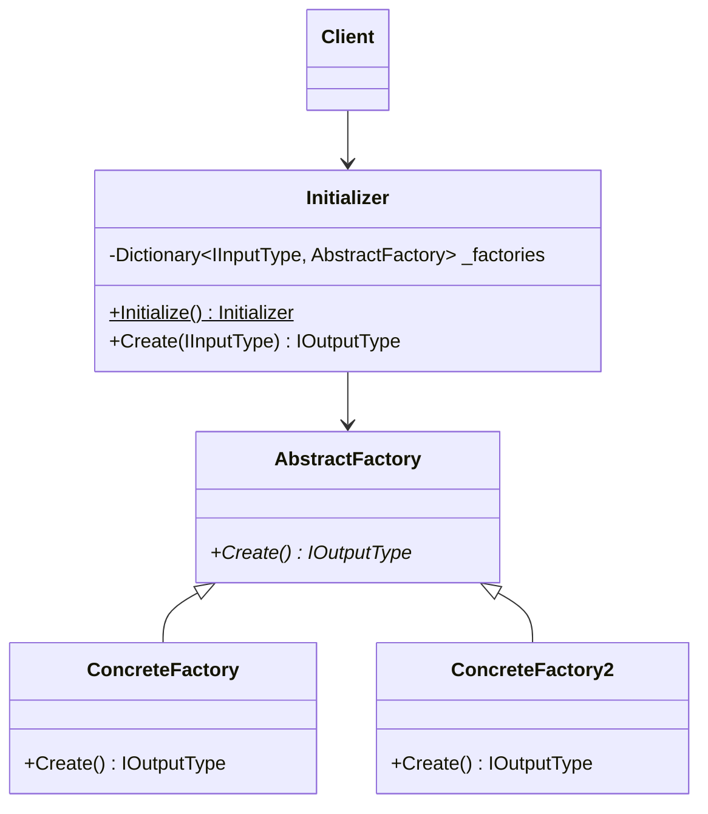

# Generic Factory
## Generic version of my favorite factory pattern implementation

### Class Diagram



### How to use
The "client" in this case is whatever class needs to convert from one type to another to call this factory implementation use 
```csharp 
Initializer.Initialize().Create(typeToConvert)
```
